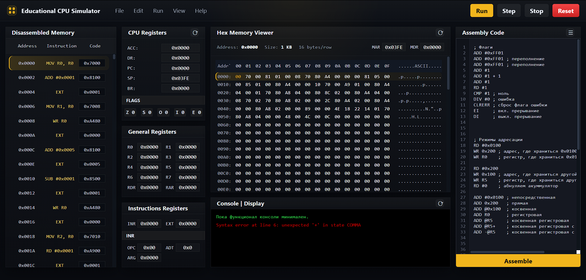

# CORE-16

## Single Page Application with 16-bit  CPU Simulator.

A custom-designed **16-bit educational CPU architecture** with accumulator-based design, instruction set, addressing modes, interrupts, and memory model.



This project was created to demonstrate low-level computer architecture concepts such as:

- Fetch–Decode–Execute cycle
- Instruction encoding
- Memory addressing modes
- Stack operations
- Interrupt handling
- Assembly-level programming

---

## 🚀 Features

- 🧠 16-bit accumulator architecture
- 📦 Unified memory space (Von Neumann model)
- 🧾 Custom instruction set (ISA)
- 🔢 Multiple addressing modes
- 📚 Stack support (CALL / RET / PUSH / POP)
- ⚡ Interrupt system (16 vectors)
- 🧮 Arithmetic and logical operations
- 🔌 Assemble compiler

---

## 🧱 Architecture Overview

The system consists of:

- CPU (ALU + Control Unit)
- RAM (1 KB)
- Register set
- Interrupt controller
- Basic I/O registers and Display
- Address bus: **10-bit**
- Data bus: **16-bit**

---

## 🧮 Registers

All registers are **16-bit**:

### Core Registers

| Register | Description |
|--------|------------|
| ACC | Accumulator (main ALU register) |
| DR | Data register |
| PC | Program counter |
| IR | Instruction register |
| EXT | Extended instruction register |
| SP | Stack pointer |
| BR | Base register |

### Memory Interface

| Register | Description |
|--------|------------|
| MAR | Memory address register |
| MDR | Memory data register |

### I/O

| Register | Description |
|--------|------------|
| IR | Input register |
| OR | Output register |

### General Registers

- From R0 to R7

### Flags

- Z — Zero
- S — Sign
- C — Carry
- O — Overflow
- I — Interrupt enable
- E — Error

---

## 💾 Memory Model

- Total memory: **1024 bytes**
- Address range: `0x0000 – 0x03FF`
- Byte-addressable

### Layout

- `0x0000 – 0x001F` - Interrupt vector table
- `0x0020 – 0x03FF` - Program + Data + Stack
- Stack grows **downwards** and starts at `SP = 0x03FE`

---

## 📜 Instruction Format

### 🔹 Instruction type 1 (16-bit)
| OPCODE   | Don't matter |
|----------|--------------|
| [15:10]  |   [9:0]      |

### 🔹 Instruction type 2 (16-bit)
| OPCODE   | OPERAND   |
|----------|-----------|
| [15:10]  | [9:0]     |

### 🔹 Instruction type 3 (32-bit)
Word 1: 

| OPCODE    | ADDRMODE | Don't matter |
|-----------|----------|--------------|
| [15:10]   | [9:7]    | [6:0]        |

Word 2: 

| DATA or OPERAND  |
|------------------|
| [15:0]           |

---

## 🔀 Addressing Modes

| Code | Mode | Example |
|------|------|--------|
| 000 | Direct | `ADD 0x22` |
| 001 | Register | `ADD R3` |
| 010 | Immediate | `ADD #34` |
| 011 | Indirect | `ADD @0x22` |
| 100 | Base-relative | `ADD [2]` |
| 101 | Register indirect | `ADD @R3` |
| 110 | Post-increment | `ADD @R3+` |
| 111 | Pre-decrement | `ADD -@R3` |

---

## ⚙️ Instruction Set

### Control

- `NOP`, `HLT`, `CLRERR`

### Arithmetic

- `ADD`, `SUB`, `CMP`, `MUL`, `DIV`, `MOD`
- `INC`, `DEC`

### Logic

- `AND`, `OR`, `XOR`, `NOT`
- `SWL`, `SWR`

### Control

- `JMP`, `JZ`, `JNZ`, `JS`, `JNS`, `JO`, `JNO`
- `JNRZ`

### Stack

- `PUSH`, `POP`, `PUSHF`, `POPF`
- `CALL`, `RET`

### Interrupts

- `INT`, `IRET`
- `EI`, `DI`

### Memory

- `MOV`
- `RD`, `WR`, `WRBR`, `WRSP`

### I/O

- `IN`, `OUT`

---

## ⚡ Interrupt System

- 16 interrupt vectors
- Located at: `0x0000 – 0x001F`
- Priority: `INT0` (highest) → `INT15` (lowest)

### Interrupt Handling

1. Push `PC` and `FLAGS` to stack
2. Load handler address from vector table
3. Jump to handler
4. Return via `IRET`

---

## 🔢 Data Representation

- 16-bit signed integers (two's complement)
- Range: -32768 ... +32767
- Flags updated automatically after ALU operations

---

## 🛠️ Example (Assembly)

```asm
    ADD #5        ; ACC += 5
    PUSH          ; push ACC
    CALL func     ; call function
    POP           ; restore ACC

func:
    INC           ; ACC++
    RET
```

## Purpose

### This project is designed for:

- 🎓 Learning computer architecture
- 🧠 Understanding low-level execution
- 🧪 Experimenting with custom ISA
- 🛠️ Building your own assembler / emulator 

## 📌 Future Improvements
- Microcode implementation
- Pipeline simulation
- Cache model
- Debugger UI
- Assembler & disassembler
- Visual execution (step-by-step)

## ⭐ Contributing

Contributions, ideas, and improvements are welcome!
